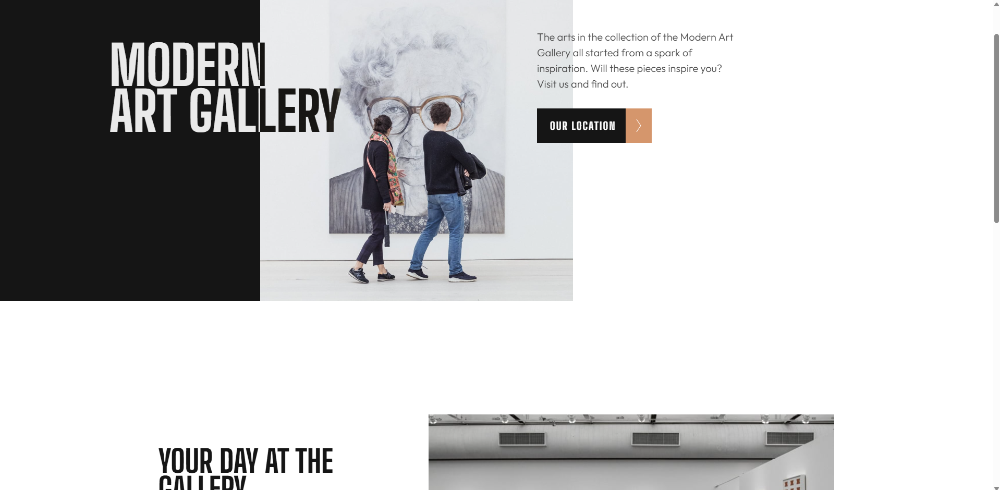

# Frontend Mentor - Art gallery website solution

This is a solution to the [Art gallery website challenge on Frontend Mentor](https://www.frontendmentor.io/challenges/art-gallery-website-yVdrZlxyA). Frontend Mentor challenges help you improve your coding skills by building realistic projects. 

## Table of contents

- [Overview](#overview)
  - [The challenge](#the-challenge)
  - [Screenshot](#screenshot)
  - [Links](#links)
- [My process](#my-process)
  - [Built with](#built-with)
  - [What I learned](#what-i-learned)
  - [Continued development](#continued-development)
  - [Useful resources](#useful-resources)
- [Author](#author)
- [Acknowledgments](#acknowledgments)

## Overview

### Screenshot

 

### Links

- Solution URL: [Add solution URL here](https://github.com/leonardoalmeida7/html-css-e-JavaScript/tree/main/025-Art-gallery-website)
- Live Site URL: [Add live site URL here](https://leonardoalmeida7.github.io/html-css-e-JavaScript/025-Art-gallery-website/index.html)

## My process

### Built with

- Semantic HTML5 markup
- CSS custom properties
- Flexbox
- CSS Grid
- Mobile-first workflow
- [Bootstrap](https://getbootstrap.com/) - CSS library

## Author

- Website - [Leonardo](https://github.com/leonardoalmeida7)
- Frontend Mentor - [@leonardoalmeida7](https://www.frontendmentor.io/profile/leonardoalmeida7)
- Linkedin - [Leonardo Silva](https://www.linkedin.com/in/leonardo-silva-475778198/)
