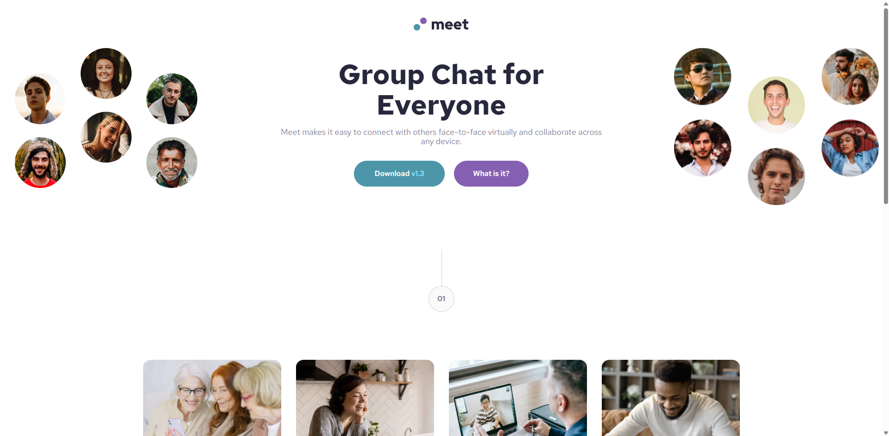
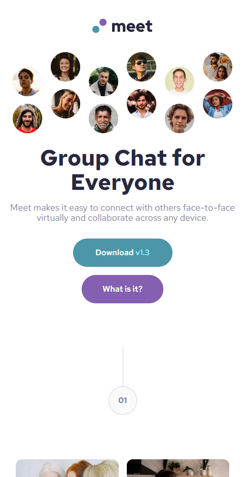

# Frontend Mentor - Meet landing page solution

This is a solution to the [Meet landing page challenge on Frontend Mentor](https://www.frontendmentor.io/challenges/meet-landing-page-rbTDS6OUR). Frontend Mentor challenges help you improve your coding skills by building realistic projects. 

## Table of contents

- [Overview](#overview)
  - [The challenge](#the-challenge)
  - [Screenshot](#screenshot)
  - [Links](#links)
- [My process](#my-process)
  - [Built with](#built-with)
- [Author](#author)

## Overview

### The challenge

Users should be able to:

- View the optimal layout depending on their device's screen size
- See hover states for interactive elements

### Screenshot

### Links

- Solution URL: [GitHub](https://github.com/leonardoalmeida7/html-css-e-JavaScript/tree/main/029-Meet-landing-page)
- Live Site URL: [GitHub Pages](https://leonardoalmeida7.github.io/html-css-e-JavaScript/029-Meet-landing-page/index.html)

## My process

### Built with

- Semantic HTML5 markup
- CSS custom properties
- Flexbox
- CSS Grid
- Mobile-first workflow
- [Bootstrap](https://getbootstrap.com/) - CSS library

## Author

- Website - [leonardoalmeida7](https://github.com/leonardoalmeida7)
- Frontend Mentor - [@leonardoalmeida7](https://www.frontendmentor.io/profile/leonardoalmeida7)

